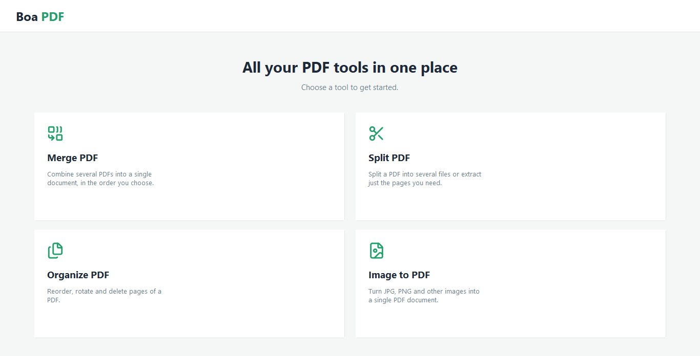

# 🐍 BoaPDF

A simple **desktop** app in Python to process PDF files, with an **iLovePDF**-style
interface: a top panel to load files and, below it, the features as cards. Native
window (Tkinter), no browser required.

This is a small personal project built mostly out of curiosity - and so that
PDF/image files don't need to be uploaded to random online tools to merge,
split or convert them. Everything runs locally on your machine.



## Features

| Tool | What it does |
|------|--------------|
| 🔗 **Merge PDF** | Combine several PDFs into one. Order the list with ↑/↓ before merging. |
| ✂️ **Split PDF** | Split by ranges (`1-3, 5, 8-10`), extract pages into a single PDF, or separate every page into its own file. |
| 🗂️ **Organize PDF** | Reorder (◀ ▶), rotate (⟳) and delete (✕) pages, with a thumbnail preview. |
| 🖼️ **Image to PDF** | Combine images into one PDF (one image per page). Order the list with ↑/↓. Supports PNG, JPG/JPEG, BMP, GIF, TIFF and other formats PyMuPDF can read. |

## Requirements

- Python 3.10+ (Tkinter is included)
- [PyMuPDF](https://pymupdf.readthedocs.io/)

## Install

```bash
pip install -r requirements.txt
```

## Run

```bash
python main.py
```

The application window opens.

## Project structure

```
BoaPDF/
├── main.py             # Entry point (launches the app)
├── requirements.txt
├── README.md
├── assets/             # Lucide SVG icons used in the UI
├── images/             # Screenshots used in this README
└── src/
    ├── __init__.py
    ├── app.py          # Main window: top bar + screen switching
    ├── style.py        # Colors, fonts and shared constants
    ├── pdfOps.py       # PDF operations + thumbnail rendering (PyMuPDF)
    ├── icons.py        # Rasterize the SVG icons (PyMuPDF) as tk.PhotoImage
    ├── widgets.py      # Reusable widgets (FlatButton, ScrollFrame, helpers)
    └── screens.py      # Home / Merge / Split / Organize / Image to PDF screens
```

## Notes

- All processing is local; files never leave your machine.
- Thumbnails and preview rotation are generated with PyMuPDF and Tkinter, with no
  extra dependencies (Pillow is not required).
- Password-protected PDFs are not supported.
- The interface icons are taken from [https://lucide.dev/](https://lucide.dev/)
  and rasterized at runtime with PyMuPDF (no extra dependencies).
